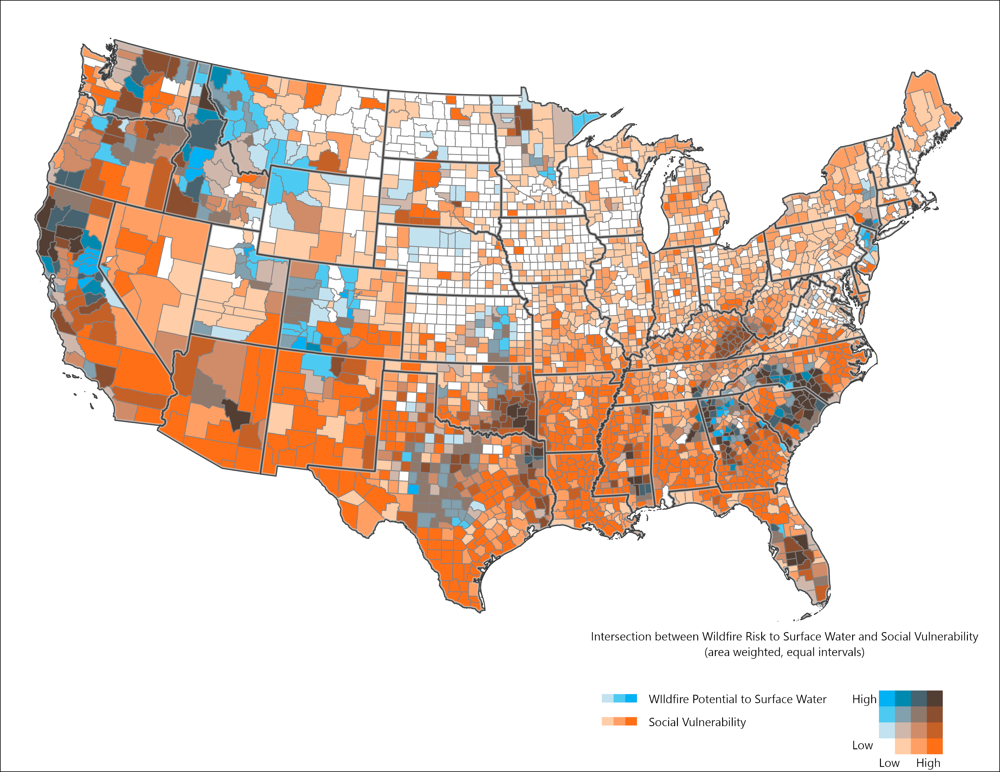

## Connecting Fire and Water

The analysis explores the connection between Wildfire Hazard Potential and surface water supplies vital for human populations. It uses data from the Forest to Faucets assessment v2.0 (Mack et al., 2022), which evaluates threats to clean water production in HUC12 watersheds across the continental U.S., considering factors like land cover, insect/disease impacts, and wildfire risk.

Specifically, the map below shows the wildfire threat to surface drinking water supplies, using the `WFP_IMP_R` (Relative Wildfire Risk to Important Drinking Water Watersheds) attribute in the Forest to Faucets dataset. This data was rasterized, merged with county-level data, and analyzed in R to produce weighted averages.


## Fire and Water Convergence by County


{fig-alt="Map of wildfire risk to surface water supplies which highlights the states such as California, Oregon and Washington, plus areas in Georgia and the Carolinas."}.

<br>

```{r}
#| label: water and fire
#| echo: false
#| message: false
#| warning: false
#| fig.width: 12


## wrangle and plot WFP data for exploration-chart not used


## load packages
library(plotly)
library(tidyverse)
library(scales)

## read data
wfp <- read.csv("data/cnty_svi_wfp.csv")


## add intervals to match ArcGIS quantiles (mostly for labels)
wfp <- wfp %>%
  mutate(quantiles =cut(weighted_wfp, 
                        breaks = c(
                          -1,
                          20,
                          40,
                          60,
                          80,
                          100),
                        labels = c(
                          "0 - 20",
                          "20 - 40",
                          "40 - 60",
                          "60 - 80",
                          "80 - 100")
  ))

## create colors to match map
colors <- c(
  "#FFFFFF",
  "#FDBE85",
  "#FD8D3C",
  "#BD5A29",
  "#77371A"
  
)


# group by quantiles for chart
wfp_pop_quantiles <- wfp %>%
  group_by(quantiles) %>%
  summarize(total_pop = sum(pop)) %>%
  mutate(percentage = round(total_pop/sum(total_pop)*100))

# make chart

wfp_quantiles_pop_chart <-
  ggplot(wfp_pop_quantiles, aes(x = quantiles, y = total_pop, fill = quantiles)) +
  geom_bar(stat = 'identity', color = '#3d3d3d') +
  coord_flip() +
  labs(
    x = "",
    y = "Total Population"
  ) +
  scale_fill_manual(values =  c(
    "#FFFFFF",
    "#FDBE85",
    "#FD8D3C",
    "#BD5A29",
    "#77371A"
    
  )) +
  scale_y_continuous(labels = comma) +
  geom_text(aes(label = paste0(percentage, "%")),
            vjust = -0.5, 
            hjust = -0.10, 
            color = "black",
            size = 6) + 
  theme_bw(base_size = 18) +
  theme(axis.line = element_line(colour = "black"),
        panel.grid.major = element_blank(),
        panel.grid.minor = element_blank(),
        panel.border = element_blank(),
        panel.background = element_blank()) +
  theme(legend.position = 'none')+
  # theme(plot.margin = margin(0, #top
  #                            3, #right
  #                            0, # bottom
  #                            0, #left
  #                            "cm")) + 
  expand_limits(y = 225000000) 


wfp_quantiles_pop_chart


```


## Convergence between fire, water and people

Our main interest was exploring where wildfire risk to surface-water derived drinking water and underserved populations converge. The map below brings all of this together.  The bivariate map below depicts both Social Vulnerability Index and the wildfire threat to surface drinking water supplies per county. 

{fig-alt="Map of wildfire risk to surface water supplies which highlights the states such as California, Oregon and Washington, plus areas in Georgia and the Carolinas."}.

## Another Way to Explore


```{r}
#| label: bubble
#| echo: false
#| message: false
#| warning: false
#| fig.width: 12
#| fig.height: 13


# read data in with colors
fire_svi_wfp_pop <- read.csv('data/fire_svi_wfp_pop_quarts_colors.csv')


fire_svi_wfp_pop$color <- as.factor(fire_svi_wfp_pop$color)


fire_svi_wfp_pop <- fire_svi_wfp_pop |>
  mutate(text = paste0(
    "<b>County:</b> ", name, "<br>",
    "<b>State:</b> ", state, "<br>",
    "<b>SVI (0 is low, 100 high):</b> ", round(svi), "<br>",
    "<b>Wildfire Risk to Important Watersheds:</b> ", round(weighted_wfp), "<br>",
    "<b>County population:</b> ", comma(pop)
  ))


# static bubble chart

fire_svi_pop_chart <- fire_svi_wfp_pop %>%
  ggplot(aes(x = weighted_wfp, 
             y = svi, 
             size = pop,
             fill = color,
             text = text)) +
  geom_point(shape = 21) +
  scale_size(range = c(.05, 15), 
             name = "County Population", 
             labels = comma,
             breaks =  c(1000,
                         10000,
                         100000,
                         1000000,
                         10000000)) +
  scale_fill_manual(values = levels(fire_svi_wfp_pop$color), guide = 'none') +
  theme_bw() +
  labs(
    x = "Wildfire Potential to Surface Water",
    y = "Social Vulnerability"
  )


# Convert ggplot chart to Plotly for exploration

plotly_chart <- ggplotly(fire_svi_pop_chart, tooltip = "text") |> 
  layout(showlegend = FALSE)

plotly_chart


```


