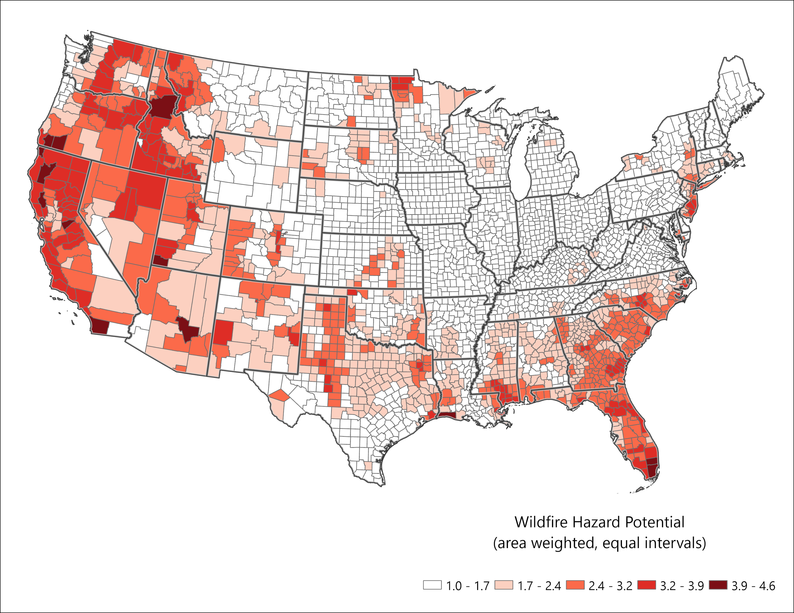

## Wildfire Hazard Potential Dataset and Brief Methods
The study uses the [Wildfire Hazard Potential (WFHP) dataset](https://research.fs.usda.gov/firelab/products/dataandtools/wildfire-hazard-potential) (Dillon et al., 2020) to assess wildfire risk across the Coterminous United States (CONUS). WHP values are assigned to 270 x 270 meter pixels, representing the potential for difficult-to-control, high-intensity wildfires. These fires may involve crown ignition, rapid spread, and burning of live and dead biomass. The WHP model incorporates burn probability, flame-length probability (Short et al., 2020), historical fire locations (Short et al., 2017), and vegetation/fuel data from LANDFIRE 2014.

Data Processing and Analysis
The continuous WHP values (not the classified 1–5 scale) were used. To summarize WHP at the county level, the researchers applied the “Combine” tool in GIS, merging WHP raster data with a rasterized county map. This produced pixel counts per WHP value for each county. Attributes were joined using the “Join Field” tool, and area-weighted averages were calculated by exporting the data to CSV and using R’s weighted.mean function.

Final Output and Mapping
The resulting table of weighted WHP values was merged back into the county shapefile, enabling spatial visualization of wildfire hazard potential across CONUS counties. This approach allowed for a nuanced, county-level understanding of wildfire risk based on high-resolution pixel data.

## WFHP summarized by county


{fig-alt="Map of the Wildfire Hazard Potential (WFHP) dataset, summarized per county for the coterminous United States.  Highlights higher WFHP values in the southern US and along the west coast. "}
<br>

Patterns of WFHP are similar to those of the Social Vulnerability Index, i.e., concentrated in the southern and western regions of the country.

<br>


```{r}
#| label: wfhp_chart
#| echo: false
#| message: false
#| warning: false
#| fig.width: 12
## load packages
library(tidyverse)
library(scales)

## read data
wfhp <- read.csv("data/cnty_wfhp.csv")

## add intervals to match ArcGIS quantiles (mostly for labels)
wfhp <- wfhp %>%
  mutate(quantiles =cut(weighted_wfhp, 
                        breaks = c(
                          0,
                          1.7,
                          2.4,
                          3.2,
                          3.9,
                          4.7),
                        labels = c(
                          "1.0 - 1.7",
                          "1.7 - 2.4",
                          "2.4 - 3.2",
                          "3.2 - 3.9",
                          "3.9 - 4.6")
  ))

## create colors to match map
colors <- c(
  "#FFFFFF",
  "#FCD0C0",
  "#FB6A4A",
  "#DE2D26",
  "#7B0F15"
  
)


# group by quantiles for chart
wfhp_pop_quantiles <- wfhp %>%
  group_by(quantiles) %>%
  summarize(total_pop = sum(pop)) %>%
  mutate(percentage = round(total_pop/sum(total_pop)*100))

# make chart

wfhp_quantiles_pop_chart <-
  ggplot(wfhp_pop_quantiles, aes(x = reorder(quantiles,total_pop),  y = total_pop, fill = quantiles)) +
  geom_bar(stat = 'identity', color = '#3d3d3d') +
  coord_flip() +
  labs(
    x = "",
    y = "Total Population"
  ) +
  scale_fill_manual(values = c(
    "#FFFFFF",
    "#FCD0C0",
    "#FB6A4A",
    "#DE2D26",
    "#7B0F15"
    
  )) +
  scale_y_continuous(labels = comma) +
  geom_text(aes(label = paste0(percentage, "%")),
            vjust = -0.5, 
            hjust = -0.10, 
            color = "black",
            size = 6) + 
  theme_bw(base_size = 18) +
  theme(axis.line = element_line(colour = "black"),
        panel.grid.major = element_blank(),
        panel.grid.minor = element_blank(),
        panel.border = element_blank(),
        panel.background = element_blank()) +
  theme(legend.position = 'none')+
  # theme(plot.margin = margin(0, #top
  #                            3, #right
  #                            0, # bottom
  #                            0, #left
  #                            "cm")) + 
  expand_limits(y = 160000000) 


wfhp_quantiles_pop_chart


```


