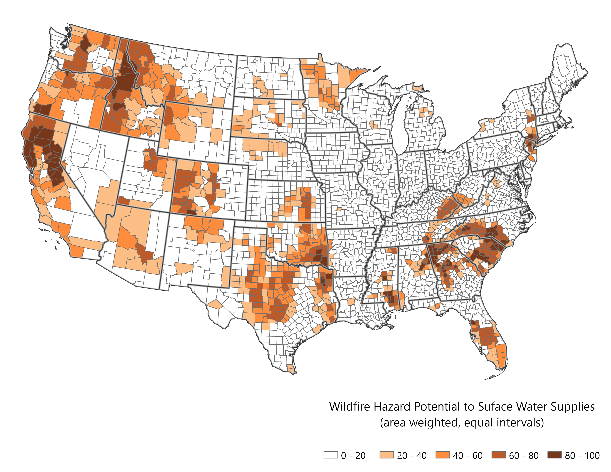

## Surface Water Importance (IMP) Overview

The IMP attribute in the Forest to Faucets dataset (Mack et al., 2022) represents the relative importance of surface water for human consumption. It is derived from a model that incorporates several key factors:

* Water intake location  
* Population served by each water source  
* Type of water source (e.g., surface water vs. groundwater)  

This model helps identify areas where surface water plays a critical role in supplying drinking water.

### Spatial Resolution and Modeling

The IMP values are calculated at the HUC 12 watershed level, providing fine-scale insight into water source importance across the landscape. Areas with higher IMP values are those where surface water is more essential to meeting human water needs.

### County-Level Aggregation

To estimate IMP at the county level, the dataset was spatially joined with a rasterized county layer using the Combine tool in ArcGIS. Relevant attributes were joined, and an area-weighted mean IMP was calculated for each county using R’s `weighted.mean` function. This process enabled mapping and analysis of surface water importance across counties in the contiguous U.S.

## Surface water to drinking water summarized by county


{fig-alt="Map of the Wildfire Hazard Potential (WFHP) dataset, summarized per county for the coterminous United States.  Highlights higher WFHP values in the southern US and along the west coast. "}.
<br>

```{r}
#| label: wrw_chart
#| echo: false
#| message: false
#| warning: false
#| fig.width: 12
## load packages
library(tidyverse)
library(scales)


## read data
wfp <- read.csv("data/cnty_svi_wfp.csv")

## add intervals to match ArcGIS quantiles (mostly for labels)
wfp <- wfp %>%
  mutate(quantiles =cut(weighted_wfp, 
                        breaks = c(
                          -1,
                          20,
                          40,
                          60,
                          80,
                          100),
                        labels = c(
                          "0 - 20",
                          "20 - 40",
                          "40 - 60",
                          "60 - 80",
                          "80 - 100")
  ))

## create colors to match map
colors <- c(
  "#FFFFFF",
  "#FDBE85",
  "#FD8D3C",
  "#BD5A29",
  "#77371A"
  
)


# group by quantiles for chart
wfp_pop_quantiles <- wfp %>%
  group_by(quantiles) %>%
  summarize(total_pop = sum(pop)) %>%
  mutate(percentage = round(total_pop/sum(total_pop)*100))

# make chart

wfp_quantiles_pop_chart <-
  ggplot(wfp_pop_quantiles, aes(x = reorder(quantiles,total_pop), y = total_pop, fill = quantiles)) +
  geom_bar(stat = 'identity', color = '#3d3d3d') +
  coord_flip() +
  labs(
    x = "",
    y = "Total Population"
  ) +
  scale_fill_manual(values =  c(
    "#FFFFFF",
    "#FDBE85",
    "#FD8D3C",
    "#BD5A29",
    "#77371A"
    
  )) +
  scale_y_continuous(labels = comma) +
  geom_text(aes(label = paste0(percentage, "%")),
            vjust = -0.5, 
            hjust = -0.10, 
            color = "black",
            size = 6) + 
  theme_bw(base_size = 18) +
  theme(axis.line = element_line(colour = "black"),
        panel.grid.major = element_blank(),
        panel.grid.minor = element_blank(),
        panel.border = element_blank(),
        panel.background = element_blank()) +
  theme(legend.position = 'none')+
  # theme(plot.margin = margin(0, #top
  #                            3, #right
  #                            0, # bottom
  #                            0, #left
  #                            "cm")) + 
  expand_limits(y = 225000000) 


wfp_quantiles_pop_chart


```


